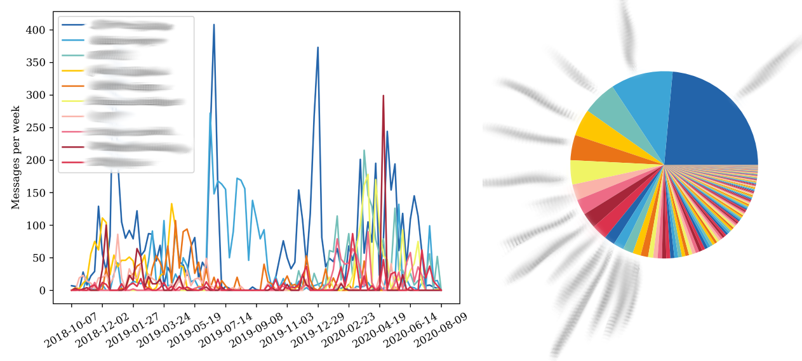

# Facebook Messenger Data Analysis

Some code for making graphs of your Facebook Messenger Data.

## Usage

Download your data from Facebook by going to

    facebook.com > Settings > Your Facebook Information > Download Your Information

Deselect everything other than "Messages", select "Format: JSON", then click "Create File".

After the download is ready (this might take a while), download it and extract the zip folder into the same directory where this program is located.

Run the files with Python 3.

There are some settings you can optionally set in the files, such as which chats to analyze, etc. They are at the top of both files, indicated by comments.

## Files included

#### direct_message_plots.py

Analyzes all direct messages (chats with only 1 member other than you) sent over time.
Generates 3 plots:
 - `lineplot_nolegend.png` A line plot showing all messages sent with each person over time.
 - `lineplot_top_n.png` A labeled line plot showing all messages sent with the n most-messaged people over time, where n defaults to 10 but can be changed.
 - `pie_chart.png` A pie chart showing percent of messages sent to each person.

#### pie_chart_by_group.py

Analyzes all chats (including direct messages and group chats) and creates a pie chart in the folder `plots_group/` for each chat, showing what percent of messages were sent by each chat participant.
